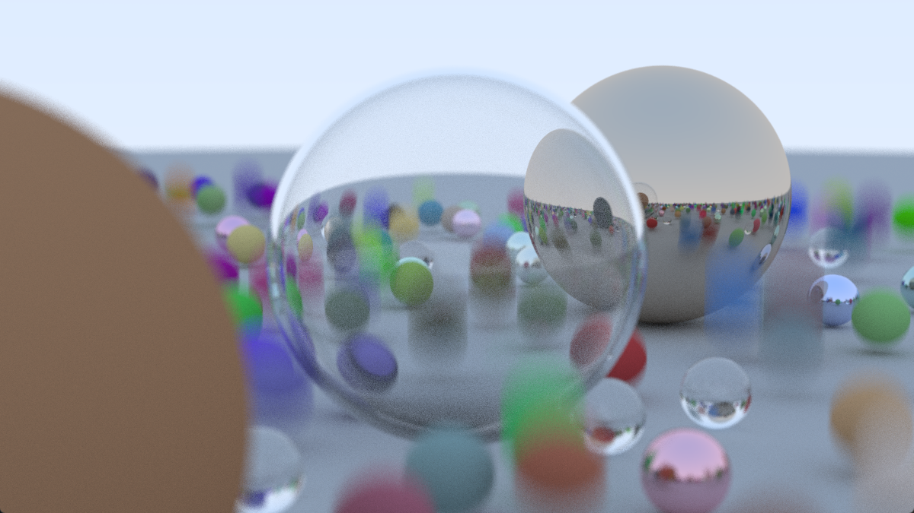
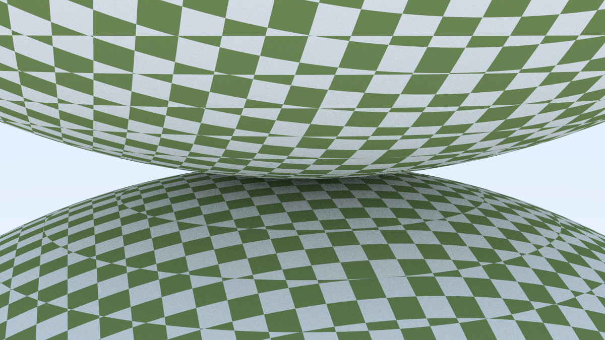
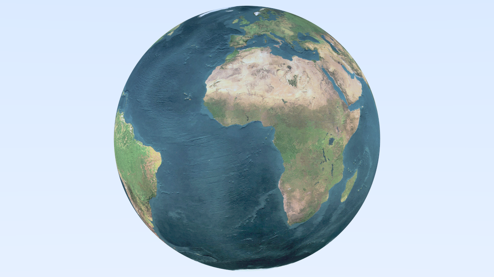
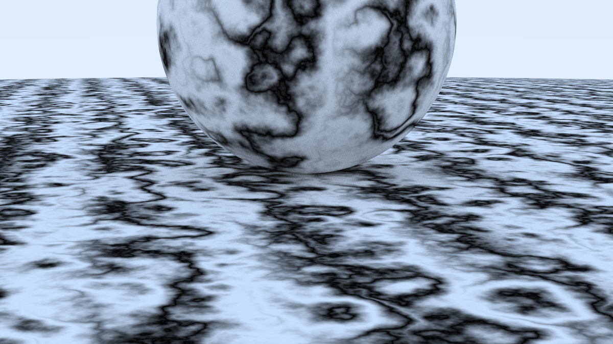
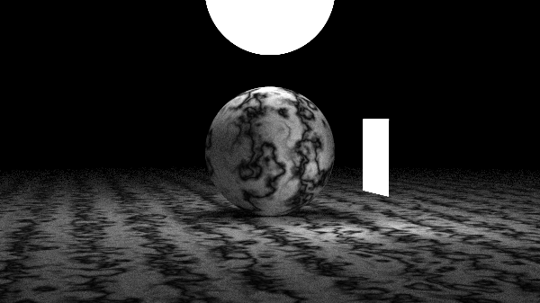
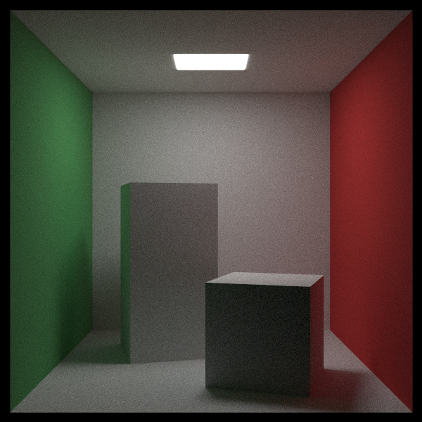
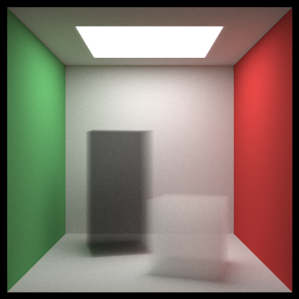

# rust-tracing

## [Ray tracing in One Weekend](https://raytracing.github.io/) implemented in Rust

### Running

Render normally to file
```
cargo run --release
```
Render with live preview
```
cargo run --release -- -l
```
See rest of commands
```
cargo run --release -- -h
```

### Screenshots

#### Scene with random spheres

#### Checker world-space material

#### Image Texturing

#### Perlin noise - marble

#### Diffuse Light material

#### Cornell Box

#### Volumetric boxes


https://github.com/Husenap/rust-tracing/assets/6496177/c71fdf9a-9200-48f7-abb1-3478b8bf8d71

